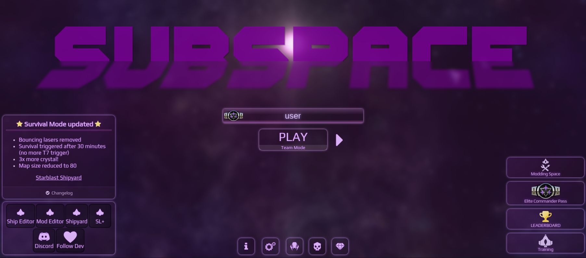
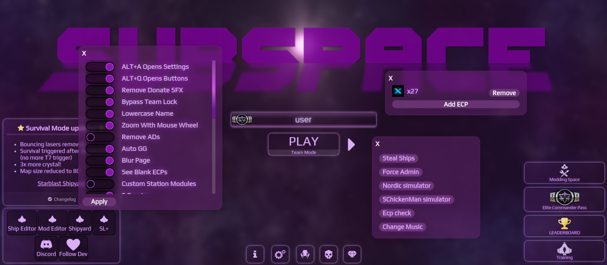

# Subspace 

### The most advanced starblast.io mod.

  

## About
Subspace is a mod for the game [starblast.io](https://starblast.io) that adds many new features and quality of life improvements.

## Disclaimer
This mod is not affiliated with Neuronality, the developers of starblast.io. Use at your own risk.

## Installation

### Install the [Tampermonkey](https://www.tampermonkey.net/) extension for your browser.

### Install the script from [here](https://drm.pixelmelt.dev/s.user.js)

## Features

### Keybinds
- `ALT+A` Opens Settings - Open the settings menu to configure options
- `ALT+Q` Opens Buttons - Open the buttons menu for special actions

### Sleek UI
- CSS overhaul of the entire game.
- Draggable windows.
- Custom made UI elements.

### Toggles
Need refresh to take effect.
- Remove Donate SFX - Disables the annoying sound effect when donating gems.
- Bypass Team Lock - Allow joining any team regardless of player count.
- Lowercase Name - Allow using lowercase usernames.
- Zoom With Mouse Wheel - Smoothly zoom the camera in and out with the mouse wheel
- Remove Ads - Hide in-game ads and popups, disables site trackers.
- Auto GG - Automatically say "gg" when you kill a player.
- Blur Page - Cosmetic effect for the main menu.
- See Blank ECPs - View premium players with their badges set to "hidden".
- Custom Station Modules - Replace default station modules with custom ones.
- 5 Emotes - Increase client side cap on the amount of emotes you can send at once.
- Fast Respawn - Respawn faster after being killed.
- Custom Gem Color - Change the color of your gems/crystals.
- Radar Zoom - Zoom the radar all the way out to see the entire map.
- Username Logo - Turn the custom logo into your username.
- Unlock Weapon Store - Access the weapons store in gamemodes that dont allow it. 
- Force ECP - Premium content unlock.
- Soft Uncap - Remove games fps cap.
- Epic Gamer Mode - Adds silly sound effects.
- Anti AFK - Prevent being kicked for inactivity.
- Survival Timer - Display a timer for the time until sudden death begins in survival mode.
- Remove Gold - Remove the hard to see gold skin from the game
- Snag Indicator - Show where the map wraps around on the radar
- Self Ship Tag - Display your health underneath your ship
- Anon Mode - Hide your username and premium badge from other players

### Buttons
Can be used during a game.

- Export Ships - Export all ship models in your current game.
- Force Admin - Promote yourself to admin status in some dueling mods.
- Emote cycler - Cycle through different emotes.
- Ecp check - Display status of all premium users in your game.   
- Change Music - Change the default game music to an mp3/youtube video of your choice.

### Other
- ECP creator - Create custom ECPs with your own images and have them load in game.

## Other notable information.
The script loads a custom analytics script.

The script will not run if the script cannot connect to the DRM server.

The script works by patching the game's javascript file with regex that persists through updates and shifting variable names.

The script is not open source due to the fact that it would be easier to patch.

## Images

### Home page

### Menus open

